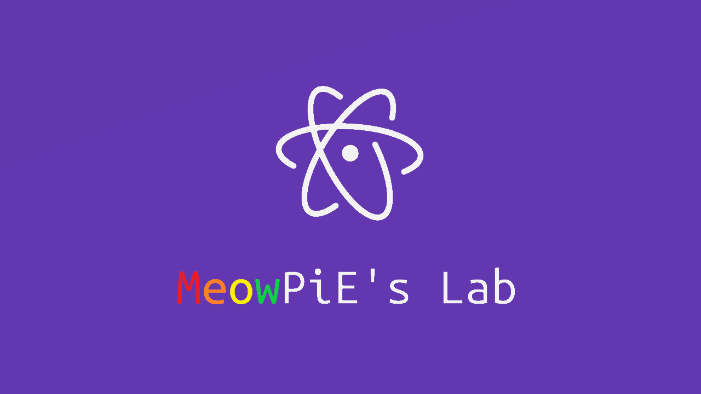

# MeowPiE's Lab



> 프로그래밍하는 냥파이의 냐옹냐옹 블로그다냥!

깃허브 페이지로 제작된 냥파이의 프로그래밍과 IT 정보를 다루는 블로그!

## YAML Front Matter

```
---
title: "Awesome Title"
author: MeowPiE
category: notice
tags: ['1', '2']
image:
  path: Picture Path
  copyright: MeowPiE
---
```

## Theme License

```text
Materialize Jekyll
Copyright (c) 2017 Astro

Permission is hereby granted, free of charge, to any person obtaining a copy
of this software and associated documentation files (the "Software"), to deal
in the Software without restriction, including without limitation the rights
to use, copy, modify, merge, publish, distribute, sublicense, and/or sell
copies of the Software, and to permit persons to whom the Software is
furnished to do so, subject to the following conditions:

The above copyright notice and this permission notice shall be included in all
copies or substantial portions of the Software.

THE SOFTWARE IS PROVIDED "AS IS", WITHOUT WARRANTY OF ANY KIND, EXPRESS OR
IMPLIED, INCLUDING BUT NOT LIMITED TO THE WARRANTIES OF MERCHANTABILITY,
FITNESS FOR A PARTICULAR PURPOSE AND NONINFRINGEMENT. IN NO EVENT SHALL THE
AUTHORS OR COPYRIGHT HOLDERS BE LIABLE FOR ANY CLAIM, DAMAGES OR OTHER
LIABILITY, WHETHER IN AN ACTION OF CONTRACT, TORT OR OTHERWISE, ARISING FROM,
OUT OF OR IN CONNECTION WITH THE SOFTWARE OR THE USE OR OTHER DEALINGS IN THE
SOFTWARE.
```

Materialize-Jekyll is licensed under the [MIT License](./LICENSE).

[Materialize](http://materializecss.com/) is licensed under a [MIT License](https://github.com/Dogfalo/materialize/blob/master/LICENSE) by Dogfalo.

[Prism.js](http://prismjs.com) is licensed under a [MIT License](https://github.com/PrismJS/prism/blob/gh-pages/LICENSE) by Lea Verou.

[Skeleton](http://getskeleton.com/) is licensed under a [MIT License](https://github.com/dhg/Skeleton/blob/master/LICENSE.md) by Dave Gamache.

[Fira Mono](https://fonts.google.com/specimen/Fira+Mono) is licensed under a [SIL OFL 1.1](http://scripts.sil.org/cms/scripts/page.php?site_id=nrsi&id=OFL_web) by Carrois Apostrophe.

[Font Awesome](http://fontawesome.io/) is licensed under [SIL OFL 1.1 and MIT License](http://fontawesome.io/license/) by Font Awesome.

[Material Design Icons](https://material.io/icons/) is licensed under an [Apache License 2.0](https://github.com/google/material-design-icons/blob/master/LICENSE) by Google.

[Quicksand](https://fonts.google.com/specimen/Quicksand) is licensed under a [SIL OFL 1.1](http://scripts.sil.org/cms/scripts/page.php?site_id=nrsi&id=OFL_web) by Andrew Paglinawan.

[Roboto](https://fonts.google.com/specimen/Roboto) is licensed under an [Apache License 2.0](http://www.apache.org/licenses/LICENSE-2.0) by Christian Robertson.

[Spoqa Han Sans](https://spoqa.github.io/spoqa-han-sans/ko-KR/) is licensed under a [SIL OFL 1.1](https://github.com/spoqa/spoqa-han-sans/blob/master/LICENSE) by Spoqa.
